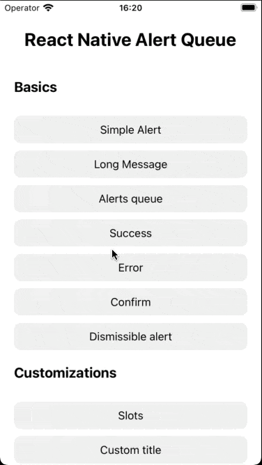
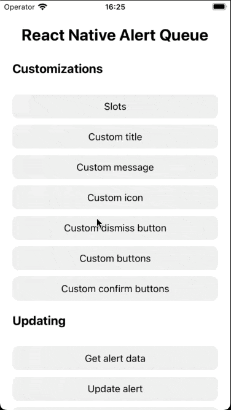
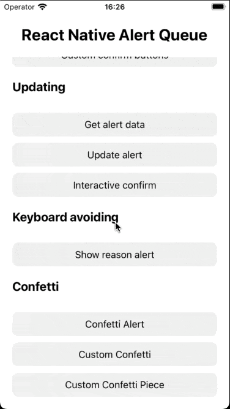
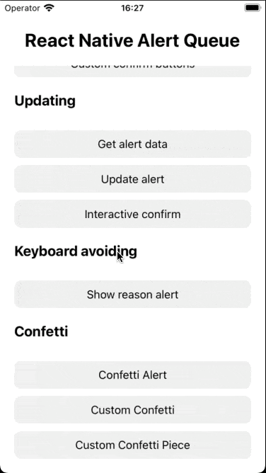
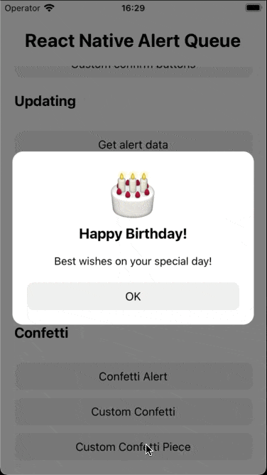

# react-native-alert-queue

React Native alert & dialog library. Queue multiple alerts, use async/await, and replace `Alert.alert` with a customizable, promise-based modal system.

[](https://www.npmjs.com/package/react-native-alert-queue)
[](https://www.npmjs.com/package/react-native-alert-queue)
[](https://snack.expo.dev/@xxsnakerxx/react-native-alert-queue)
[](https://opensource.org/licenses/MIT)
[](https://github.com/sponsors/xxsnakerxx)


[](https://github.com/callstack/react-native-builder-bob)
[](http://makeapullrequest.com)

## Key Features

- ⚡ Easy `async/await` usage (`await alert.show()`)
- ⏳ Sequential alert queue management
- 🛠️ Realtime UI update: dynamically update alert title, message, buttons, and more
- 🎨 Full UI customization with slots and custom renderers
- 🖼️ SVG icon support
- ⚙️ Global styling and behavior configuration
- ✅ Built-in helpers for success, error, and confirm dialogs
- 🎉 Confetti support
- 🌐 React Native Web support

## 📺 Demo

See how `react-native-alert-queue` works in action! 🚀

### 🚀 Live Demo (Expo Snack)

Try it instantly in your browser:

👉 https://snack.expo.dev/@xxsnakerxx/react-native-alert-queue


### 🛠 Basics

Basic usage:



---

### 🎨 Customizations

Custom titles, messages, icons, buttons, and slots:



---

### 🔄 Real-Time Updating

Dynamically update the alert while it's displayed:



---

### 🎹 Keyboard Avoidance

Alerts automatically adjust position when the keyboard appears:



---

### 🎉 Confetti Animation

Celebrate success with built-in confetti effects:



---

## Requirements

- `2.x` versions require [`react-native-reanimated 3.x`](https://docs.swmansion.com/react-native-reanimated/).
- If your project does not use Reanimated, you can use `react-native-alert-queue@1.x`.

Install `RN Reanimated` following [their official guide](https://docs.swmansion.com/react-native-reanimated/docs/fundamentals/getting-started#installation).

## Installation

```sh
npm install react-native-alert-queue
# or
yarn add react-native-alert-queue
# or
pnpm add react-native-alert-queue
```

## Usage

> ⚡ **Full working examples available!**
> Explore the [example app here](https://github.com/xxsnakerxx/react-native-alert-queue/tree/main/example/src/containers) to see all features in action.

### Basic Setup

First, add the `AlertContainer` to your app:

```tsx
import { AlertContainer } from 'react-native-alert-queue';

function App() {
  return (
    <View>
      {/* Your app content */}
      <AlertContainer />
    </View>
  );
}
```

### Showing Alerts

Anywhere in your app you can show alerts by using the `alert` object:

```tsx
import { alert } from 'react-native-alert-queue';

// Basic alert
alert.show({
  title: 'Hello',
  message: 'I am an alert',
});

// Success alert
alert.success({
  message: 'Operation successful',
});

// Error alert
alert.error(new Error('Something went wrong'));

// Confirm dialog
const result = await alert.confirm({
  message: 'Are you sure you want to proceed?',
});
```

### Alert Types

#### Basic Alert

```tsx
alert.show({
  title: 'Custom Alert',
  message: 'This is a custom alert',
  buttons: [
    {
      text: 'OK!',
      onPress: () => console.log('OK pressed'),
    },
  ],
});
```

#### Success Alert

```tsx
alert.success({
  message: 'Operation completed successfully',
});
```

#### Error Alert

```tsx
alert.error(new Error('Operation failed'));
```

#### Confirm Dialog

```tsx
const result = await alert.confirm({
  message: 'Are you sure you want to proceed?',
});
```

### Confetti

```tsx
alert.show({
  message: 'Welcome to the app!',
  confetti: true,
});
```

```tsx
alert.show({
  title: 'Congratulations!',
  message: 'You are a winner!',
  confetti: {
    colors: ['#4CAF50', '#8BC34A', '#CDDC39', '#81C784', '#A5D6A7', '#C8E6C9'],
    numberOfPieces: 200,
    pieceDimensions: {
      height: 10,
      width: 30,
    },
  },
});
```

Confetti can be used with any alert type. Also, you can customize the confetti appearance globally in the config.

### Advanced Features

#### Custom Helper Functions

You can create your own helper functions to simplify common alert patterns in your app:

```tsx
const transactionCompletedAlert = (amount: string) =>
  alert.show({
    title: 'Transaction Complete',
    message: `Successfully transferred ${amount}`,
    icon: SuccessIcon,
    buttons: [
      {
        text: 'View Details',
        onPress: () => navigateToTransactionDetails(),
      },
      {
        text: 'Done',
      },
    ],
  });

// Create a custom error alert for network issues
const networkErrorAlert = (retryCallback: () => void) =>
  alert.show({
    title: 'Network Error',
    message: 'Network connection lost',
    icon: NetworkErrorIcon,
    buttons: [
      {
        text: 'Retry',
        onPress: retryCallback,
      },
      {
        text: 'Cancel',
      },
    ],
  });

// Usage
await transactionCompletedAlert('$100.00');

networkErrorAlert(() => fetchData());
```

#### Custom Rendering

```tsx
alert.show({
  title: 'Custom Alert',
  message: 'This alert has custom rendering',
  renderTitle: ({ style, text }) => (
    <Text style={[style, { color: 'red' }]}>{text}</Text>
  ),
  renderMessage: ({ style, text }) => (
    <Text style={[style, { fontSize: 16 }]}>{text}</Text>
  ),
  renderButton: (props) => (
    <TouchableOpacity
      style={[styles.button, props.disabled && styles.disabled]}
      onPress={props.onPress}
      disabled={props.disabled}
    >
      <Text style={styles.buttonText}>{props.text}</Text>
    </TouchableOpacity>
  ),
  renderDismissButton: ({ onPress }) => (
    <TouchableOpacity onPress={onPress}>
      <Text>×</Text>
    </TouchableOpacity>
  ),
});
```

#### Slots

Slots allow you to inject custom content at specific positions within the alert:

```tsx
alert.show({
  title: 'Alert with Slots',
  message: 'This alert uses slots for custom content',
  // Content before the title
  beforeTitleSlot: () => (
    <View style={styles.badge}>
      <Text style={styles.badgeText}>New</Text>
    </View>
  ),
  // Content before the message
  beforeMessageSlot: () => <View style={styles.divider} />,
  // Content before the buttons
  beforeButtonsSlot: () => (
    <View style={styles.terms}>
      <Text>By continuing you agree to our terms</Text>
    </View>
  ),
  // Content after the buttons
  afterButtonsSlot: () => (
    <View style={styles.footer}>
      <Text style={styles.footerText}>Need help? Contact support</Text>
    </View>
  ),
});
```

#### Async Operations

```tsx
const result = await alert.show<string | null>({
  title: 'Async Operation',
  buttons: [
    {
      text: 'Confirm',
      onAwaitablePress: async (resolve) => {
        // Perform async operation
        resolve('Operation completed');
      },
    },
    {
      text: 'Cancel',
      onAwaitablePress: async (resolve) => {
        resolve(null);
      },
    },
  ],
});
```

#### Queue Management

```tsx
// These alerts will be shown in sequence
alert.show({ message: 'First alert' });
alert.show({ message: 'Second alert' });
alert.show({ message: 'Third alert' });
```

#### Custom Button Props

You can extend the `AlertButtonCustomProps` interface to add custom properties to your buttons using TypeScript declaration merging:

```tsx
// In your project's type declaration file (e.g., types.d.ts)
import 'react-native-alert-queue';

declare module 'react-native-alert-queue' {
  interface AlertButtonCustomProps {
    // Add your custom props here
    variant?: 'primary' | 'secondary' | 'danger';
    size?: 'small' | 'medium' | 'large';
    isLoading?: boolean;
    // ... any other custom props
  }
}

// Usage in your components
alert.show({
  title: 'Custom Button Props',
  message: 'This alert uses custom button props',
  buttons: [
    {
      text: 'Primary Button',
      customProps: {
        variant: 'primary',
        size: 'large',
        isLoading: true,
      },
    },
    {
      text: 'Secondary Button',
      customProps: {
        variant: 'secondary',
        size: 'medium',
      },
    },
  ],
  // you can define it globally in the config or override it here
  renderButton: (props) => (
    <TouchableOpacity
      style={[
        styles.button,
        styles[props.customProps.variant],
        styles[props.customProps.size],
      ]}
      onPress={props.onPress}
      disabled={props.disabled || props.customProps.isLoading}
    >
      {props.customProps.isLoading ? (
        <ActivityIndicator color="white" />
      ) : (
        <Text style={styles.buttonText}>{props.text}</Text>
      )}
    </TouchableOpacity>
  ),
});
```

### Configuration

You can customize the default appearance and behavior of alerts using the `config` prop:

```tsx
<AlertContainer
  config={{
    testID: 'alert_test_id',
    backdrop: {
      backgroundColor: 'rgba(255, 255, 255, 0.5)',
    },
    alertStyle: {
      borderRadius: 20,
      padding: 20,
      backgroundColor: theme.colors.alert.background,
    },
    success: {
      icon: SuccessIcon,
      iconColor: 'green',
      title: 'Success',
    },
    error: {
      icon: ErrorIcon,
      iconColor: 'red',
      title: 'Error',
    },
    buttons: {
      gap: 10,
      default: {
        text: 'OK',
        testID: 'default-button',
      },
    },
  }}
/>
```

### API Reference

#### Alert Methods

- `show(alert: AlertProps)` - Shows a custom alert
- `success(alert: AlertProps)` - Shows a success alert
- `error(error: Error)` - Shows an error alert
- `confirm(alert?: ConfirmProps)` - Shows a confirmation dialog
- `hide()` - Hides the currently displayed alert
- `clearQueue(hideDisplayedAlert?: boolean)` - Clears the alert queue
- `update(id: string, alert: AlertProps)` - Updates an existing alert
- `getAlertData(id: string)` - Retrieves alert data by ID

#### Alert Props

- `id?: string` - Unique identifier
- `title?: string` - Alert title
- `message?: string` - Alert message
- `testID?: string` - Test identifier
- `isDismissible?: boolean` - Whether alert can be dismissed
- `buttonsDirection?: 'row' | 'column'` - Button layout direction
- `icon?: FC<IconProps>` - Custom icon component
- `iconColor?: ColorValue` - Icon color
- `iconSize?: number` - Icon size
- `buttons?: AlertButton[]` - Array of buttons
- `confetti?: boolean | ConfettiProps` - Confetti configuration
- `renderMessage?: ({ style, text }) => ReactElement` - Custom message renderer
- `renderTitle?: ({ style, text }) => ReactElement` - Custom title renderer
- `renderButton?: (props) => ReactElement` - Custom button renderer
- `renderDismissButton?: ({ onPress }) => ReactElement` - Custom dismiss button renderer
- `beforeTitleSlot?: () => ReactElement` - Content to render before the title
- `beforeMessageSlot?: () => ReactElement` - Content to render before the message
- `beforeButtonsSlot?: () => ReactElement` - Content to render before the buttons
- `afterButtonsSlot?: () => ReactElement` - Content to render after the buttons

#### AlertButton Props

- `text: string` - Button text
- `onPress?: () => Promise<R> | R` - Press handler
- `disabled?: boolean` - Whether button is disabled
- `testID?: string` - Test identifier
- `hideAlertOnPress?: boolean` - Whether to hide alert on press
- `onAwaitablePress?: (resolve) => void` - Async press handler
- `customProps?: AlertButtonCustomProps` - Custom button properties

#### AlertConfig

```tsx
type AlertConfig = {
  // Test identifier for the alert
  testID?: string;

  backdrop?: {
    // Background color of the backdrop
    backgroundColor?: ColorValue;
    // Custom content to render inside the backdrop
    children?: React.ReactNode;
  };

  // Custom alert style
  alertStyle?: StyleProp<ViewStyle>;

  // Default success alert configuration
  success?: {
    // Custom icon component for success alerts
    icon?: FC<IconProps>;
    // Icon color for success alerts
    iconColor?: ColorValue;
    // Icon size for success alerts
    iconSize?: number;
    // Default title for success alerts
    title?: string;
  };

  // Default error alert configuration
  error?: {
    // Custom icon component for error alerts
    icon?: FC<IconProps>;
    // Icon color for error alerts
    iconColor?: ColorValue;
    // Icon size for error alerts
    iconSize?: number;
    // Default title for error alerts
    title?: string;
  };

  // Default confirm dialog configuration
  confirm?: {
    // Custom icon component for confirm dialogs
    icon?: FC<IconProps>;
    // Icon color for confirm dialogs
    iconColor?: ColorValue;
    // Icon size for confirm dialogs
    iconSize?: number;
    // Default title for confirm dialogs
    title?: string;
    // Default button texts for confirm dialogs
    buttons?: {
      text: string;
      customProps?: AlertButtonCustomProps;
    }[];
  };

  // Global icon configuration
  icon?: {
    // Default icon size
    size?: number;
    // Default icon color
    color?: ColorValue;
  };

  // Confetti configuration
  confetti?: ConfettiProps;

  // Custom renderers for alert components
  renderTitle?: AlertProps['renderTitle'];
  renderMessage?: AlertProps['renderMessage'];
  renderDismissButton?: AlertProps['renderDismissButton'];

  // Custom slots for additional content
  afterButtonsSlot?: AlertProps['afterButtonsSlot'];
  beforeButtonsSlot?: AlertProps['beforeButtonsSlot'];
  beforeMessageSlot?: AlertProps['beforeMessageSlot'];
  beforeTitleSlot?: AlertProps['beforeTitleSlot'];

  // Button configuration
  buttons?: {
    // Gap between buttons
    gap?: number;
    // Custom button renderer
    render?: AlertProps['renderButton'];
    // Default button configuration
    default?: {
      // Default button text
      text?: string;
      // Default button testID
      testID?: string;
    };
  };
};
```

## Contributing

See the [contributing guide](CONTRIBUTING.md) to learn how to contribute to the repository and the development workflow.

## License

MIT

---

Made with [create-react-native-library](https://github.com/callstack/react-native-builder-bob)
